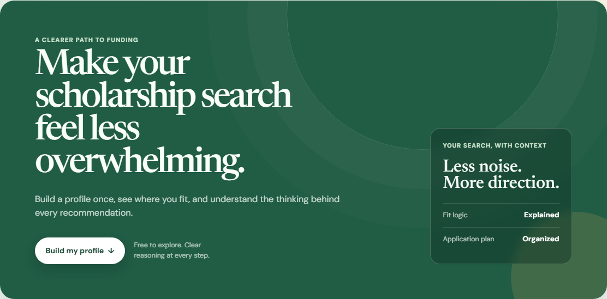
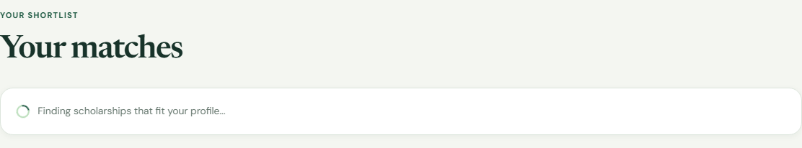
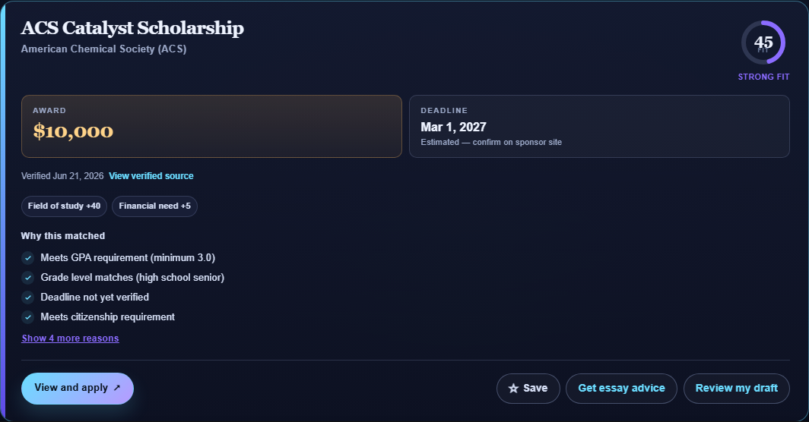

# Scholarships4U

**Live demo:** [scholarships4u.dev](https://scholarships4u.dev/)

Scholarships4U is a **curated scholarship and summer-program planner** for U.S. students — a portfolio-grade web app backed by manually verified datasets of real scholarships and elite pre-college programs. Students build a profile once, see ranked matches with transparent scoring, track applications, and get practical essay guidance from a server-side LLM. Optional free accounts save the profile and bookmark scholarships between visits.

> **What this is:** a focused demo with honest data provenance, not a comprehensive scholarship search engine. Always confirm eligibility and deadlines on each sponsor's official site.

## Screenshots

| Hero & profile flow | Match results | Result detail |
| --- | --- | --- |
|  |  |  |

## How it works

**Matching.** The app scores each scholarship with a transparent additive algorithm over field-of-study overlap, demographic tag overlap, an optional target-school match, activity keywords found in the scholarship description, and a need-based signal for students who indicated financial need. GPA, grade level, state, citizenship, and passed deadlines act as hard filters only when the dataset holds a real value (not a `VERIFY` placeholder). Students choose their actual class year; broad sponsor rules such as `high_school` or `college_undergraduate` are handled internally so a senior still sees awards open to all high school students, and a junior still sees broad undergraduate awards. Open-to-all scholarships receive a lower field score than specific field matches. A scholarship with a specific field or school but no corresponding student overlap stays visible as a **Possible** match with an eligibility caveat, never a **Strong** one. Scholarships with niche requirements the profile cannot verify (for example nomination, membership, finalist status, military affiliation, or no direct application) stay visible in a separate **Special opportunities to check** lane instead of being treated like ordinary matches. Every result shows human-readable reasons plus score-component chips. The results view can sort by fit, deadline, award, or name and filter by tier, minimum score, essay requirement, field/school/background overlap, closing-soon status, verified data, and special-check status. These display filters run in the browser over the current match response, which is appropriate for the small curated dataset.

**Elite summer programs.** The same profile also powers a smaller source-verified summer-program catalog. Program matching reuses the scholarship gates for grade level, GPA, citizenship, field overlap, and deadlines, then adds a practical financial-access signal for free or stipend programs. Program cards show cost, format, dates, source provenance, and source-linked application steps. Programs with gates the profile cannot verify, such as a school nomination, are separated into a **Special programs to check** lane instead of being treated like ordinary Strong fits.

**Essay advice.** When a student clicks **Get essay advice** on a result card, the backend sends the student's actual profile inputs and the scholarship description to the Anthropic API. The response suggests essay angles tied to the student's stated activities and background, notes what the sponsor likely values, and flags one common mistake. A separate **Review my draft** action sends a draft the student pastes in and returns targeted feedback (strengths, the highest-impact improvements, alignment with the sponsor, and mechanics) without rewriting the essay for them. Before any AI feature sends profile, resume, or essay content to Anthropic, the browser shows a clear consent prompt. The API key never leaves the server.

**Resume auto-fill.** A student can upload a PDF resume or paste its text instead of filling the form by hand. With consent, the server sends it to the Anthropic API with a tool schema constrained to the app's vocabulary, and the model returns a structured profile that pre-fills the form. Every value is filtered against the allowed vocabulary on the server, so only known tags reach the form, and the student reviews and completes the profile before matching. Demographics are set only when the resume states them explicitly, uploaded files are not stored, and both file and text sizes are capped before content is sent upstream.

**Accounts.** Accounts are optional. Without one, the app works exactly as before and keeps no data between visits. With an account (email and password), the student's profile is saved and prefilled on their next visit, and they can bookmark scholarships and summer programs to a personal saved list. Saved items double as an application tracker: each one carries a status (interested, drafting, submitted, awarded, or rejected) and free-text notes, so the student can see where every application stands. Verified pilot awards and all seed summer programs include persistent, source-linked application checklists, so students can see the next required step instead of only a match score. Tracker cards use their application status, not a stale match tier, as their visual signal. Scholarship deadlines export to an `.ics` calendar file. Passwords are stored as bcrypt hashes, never in plain text. The login is kept in a signed, httponly session cookie, so the session identifier is not readable by client JavaScript.

## Tech stack

- **Backend:** Python, FastAPI
- **Frontend:** Vanilla HTML, CSS, and JavaScript (served by FastAPI), with a dark responsive interface and source-linked match cards
- **Curated data:** Pydantic models, local JSON files for scholarships and elite summer programs loaded at startup
- **Accounts and saved data:** SQLAlchemy ORM, SQLite locally and Postgres in production, bcrypt password hashing, signed session cookies
- **Schema migrations:** Alembic, run automatically at startup and before the Render web service starts
- **LLM:** Anthropic API (Claude Sonnet) for essay advice, server-side only
- **Transactional email:** Resend for password-reset links

## Run locally

### 1. Create a virtual environment

```bash
python -m venv .venv
```

Windows:

```bash
.venv\Scripts\activate
```

macOS or Linux:

```bash
source .venv/bin/activate
```

### 2. Install dependencies

```bash
pip install -r requirements.txt
```

For development and tests:

```bash
pip install -r requirements-dev.txt
```

Apply the current database schema (the app also does this automatically at startup):

```bash
alembic upgrade head
```

### 3. Set the API key

Copy the example env file and add your key:

```bash
copy .env.example .env
```

On macOS or Linux, use `cp .env.example .env`.

Edit `.env` and set:

```
ANTHROPIC_API_KEY=your_key_here
SESSION_SECRET=any_long_random_string
```

The real key belongs only in `.env`, which is gitignored. Do not put a real key in `.env.example`.

`ANTHROPIC_API_KEY` is required for essay advice. Each request incurs Anthropic API usage cost. `SESSION_SECRET` signs login session cookies; any long random string works locally.

`DATABASE_URL` is optional locally. When it is unset, the app creates a SQLite file (`scholarships4u.db`) in the project folder and uses it automatically, so accounts work with no extra setup.

### 4. Start the server

```bash
uvicorn app.main:app --reload
```

Open the app at [http://127.0.0.1:8000/](http://127.0.0.1:8000/).

API docs: [http://127.0.0.1:8000/docs](http://127.0.0.1:8000/docs)

## Deploy (Render)

This repo includes a [`render.yaml`](render.yaml) for [Render](https://render.com/) free-tier services. It defines both the web service and a free Postgres database.

1. Push the repository to GitHub (without `.env`).
2. In Render, create a **Blueprint** from the repo. Render reads `render.yaml` and provisions:
   - A web service with build `pip install -r requirements.txt` and start `uvicorn app.main:app --host 0.0.0.0 --port $PORT`.
   - A free Postgres database, wired to the web service as `DATABASE_URL`.
   - A generated `SESSION_SECRET`.
   - `SESSION_COOKIE_SECURE=true` so session cookies are sent only over HTTPS.
3. In the Render dashboard, set these secrets under **Environment Variables**:
   - `ANTHROPIC_API_KEY` = your Anthropic API key
   - `RESEND_API_KEY` = a Resend API key for transactional email
   - `EMAIL_FROM` = a sender address verified in Resend, such as `Scholarships4U <no-reply@mail.scholarships4u.dev>`
   - `PUBLIC_APP_URL` = the public HTTPS URL for the app, such as `https://scholarships4u.dev`

Do not commit API keys. Set them only in the host's environment variable UI. The app reads `DATABASE_URL` and switches from SQLite to Postgres automatically, so saved accounts persist across deploys.

### Custom domain

The production deployment is intended to run at [`https://scholarships4u.dev`](https://scholarships4u.dev). Add the custom domain in Render, copy Render's DNS records into the domain registrar, and wait for Render to verify the records and issue HTTPS. After the domain resolves, set `PUBLIC_APP_URL=https://scholarships4u.dev` and redeploy so password-reset links, sitemap URLs, and social preview image URLs point at the public domain.

### Password-reset email

Password reset uses Resend over its HTTPS API. The app stores only a SHA-256 hash of each one-time reset token, expires tokens after one hour, uses the same response for known and unknown email addresses, and invalidates other active sessions after a successful reset. The production sender is expected to be a verified Resend domain such as `mail.scholarships4u.dev`; until `RESEND_API_KEY`, `EMAIL_FROM`, and `PUBLIC_APP_URL` are configured and redeployed, the reset form safely reports that it is temporarily unavailable instead of pretending an email was sent.

The free Postgres plan and free web service are enough for a demo. On the free tier the database can expire after a period of inactivity, so treat saved data as non-critical.

### Railway (alternative)

1. Create a new project from the GitHub repo.
2. Set the start command:

```bash
uvicorn app.main:app --host 0.0.0.0 --port $PORT
```

3. Add a Postgres database to the project. Railway exposes its connection string as `DATABASE_URL`.
4. In the **Variables** tab, set `ANTHROPIC_API_KEY`, `SESSION_SECRET` (any long random string), `SESSION_COOKIE_SECURE=true`, and the same email variables described in the Render section if password reset should be enabled.

## API endpoints

| Method | Path | Description |
|--------|------|-------------|
| `GET` | `/` | Web app |
| `GET` | `/health` | Health check |
| `GET` | `/robots.txt` | Crawler rules |
| `GET` | `/sitemap.xml` | Public page sitemap |
| `GET` | `/vocabulary` | Form option lists |
| `GET` | `/scholarships` | Full dataset |
| `POST` | `/match` | Rank scholarships for a profile |
| `POST` | `/essay-advice` | Generate essay guidance |
| `POST` | `/essay-review` | Feedback on a student's essay draft |
| `POST` | `/resume/extract` | Extract a profile from a resume (PDF or text) |
| `POST` | `/auth/signup` | Create an account and start a session |
| `POST` | `/auth/login` | Log in and start a session |
| `POST` | `/auth/logout` | End the session |
| `GET` | `/auth/me` | Current logged-in user |
| `POST` | `/auth/change-password` | Change password (requires login) |
| `POST` | `/auth/password-reset/request` | Send a one-time reset link without revealing whether the email exists |
| `POST` | `/auth/password-reset/confirm` | Consume a valid reset token and set a new password |
| `POST` | `/auth/delete-account` | Delete account and all saved data |
| `GET` | `/account/profile` | Get the saved profile |
| `PUT` | `/account/profile` | Save or update the profile |
| `GET` | `/account/saved` | List saved scholarships |
| `POST` | `/account/saved/{id}` | Save a scholarship |
| `PATCH` | `/account/saved/{id}` | Update tracker status or notes |
| `DELETE` | `/account/saved/{id}` | Remove a saved scholarship |
| `GET` | `/account/saved/calendar.ics` | Download saved deadlines as a calendar |

## Tests

```bash
pip install -r requirements-dev.txt
python -m pytest tests/ -v
```

Tests mock Anthropic calls. No paid API usage during the test run.

GitHub Actions runs the test suite and the dataset validator on every push and pull request.

To refresh the README screenshots after UI changes:

```bash
pip install playwright
python -m playwright install chromium
python scripts/capture_readme_screenshots.py
```

The screenshot script defaults to `https://scholarships4u.dev`. Set `SCHOLARSHIPS4U_URL` to target a staging or local deployment instead.

To smoke-test the live deployment:

```bash
python scripts/smoke_test_live.py
```

The smoke test also defaults to `https://scholarships4u.dev`; override it with `SCHOLARSHIPS4U_URL` when needed.

### Dataset validation

Audit the scholarship dataset for structural and vocabulary issues, and see how many fields still need verification:

```bash
python scripts/validate_dataset.py
```

It exits non-zero on structural errors (duplicate ids, unparseable deadlines), so it is suitable for a pre-commit or CI check.

## Scholarship and summer-program data verification

The scholarship dataset in [`app/data/scholarships.json`](app/data/scholarships.json) and the summer-program dataset in [`app/data/summer_programs.json`](app/data/summer_programs.json) are **curated seed sets** of real programs that are verified incrementally over time. Each entry carries a boolean `verified` flag:

- **`verified: true`** — the entry's key facts (award, eligibility, and, where the current cycle is published, the deadline) have been checked against the sponsor's official page. These entries show no "Unverified data" badge in the app.
- **`verified: false`** (the default) — not yet confirmed. These entries may hold `VERIFY` placeholders for fields that are not yet known (`deadline`, `min_gpa`, `citizenship_requirement`, or `states`). The matcher treats `VERIFY` permissively (it never excludes on an unknown value), and the UI shows an "Unverified data" badge.

### Verification provenance

Verification distinguishes a recorded official `source_url` from a fresh fact audit. `last_verified_at` appears only when the entry was independently checked on that date; older entries can carry a source link with `provenance_recorded_at` and no audit date. Result cards label those cases differently, and the dataset validator reports both counts. An audit older than 90 days is visibly flagged for re-checking; the validator's re-verification queue includes both those stale audits and source-only records that have not received a fresh audit.

School-specific records list the eligible institutions and common aliases (for example, `UT Austin`). A matching target school adds a visible fit signal; a known mismatch is shown as **Possible** with an eligibility caveat instead of being silently hidden.

### How entries get verified

Verification is an ongoing pass, done in small batches so each fact is checked rather than guessed:

1. Look the program up on its **official sponsor page** (not an aggregator).
2. Fill the fields that can be confirmed: award amount, GPA floor, grade level, citizenship requirement, and demographic focus.
3. Set a real ISO `deadline` **only when the sponsor has published the current cycle's date.** Deadlines change yearly, so an unconfirmed date is left as `VERIFY` on purpose — a wrong deadline in a student-facing tool is worse than an honest placeholder.
4. Flip `verified` to `true` once the material facts are confirmed.

Because some scholarships and programs have not yet announced their upcoming cycle, full verification is a moving target: a portion of the dataset stays honestly marked `VERIFY` until those dates are posted.

### Checking current status

Run the validator at any time to see how many entries are verified, which ones need re-verification, and how many `VERIFY` placeholders remain per field:

```bash
python scripts/validate_dataset.py
```

As of the latest update, the app includes **204 scholarships** and **52 elite summer programs**. Every entry is sponsor-verified at the record level; many individual fields still carry `VERIFY` placeholders where the upcoming cycle has not been published yet. A sidecar file, [`app/data/special_requirements.json`](app/data/special_requirements.json), records niche scholarship eligibility gates that should be surfaced as special checks rather than normal Strong matches. Summer programs can carry the same special-check metadata directly in their eligibility block. Run the validator for the current re-verification queue and placeholder counts.

## Project structure

```
ScholarMatch/
├── render.yaml
├── requirements.txt
├── requirements-dev.txt
├── .env.example
├── tests/
└── app/
    ├── main.py
    ├── vocabulary.py
    ├── api/          (auth and account routes)
    ├── auth/         (password hashing, session dependency)
    ├── db/           (SQLAlchemy engine and ORM models)
    ├── essay/
    ├── matching/
    ├── models/
    ├── static/
    └── data/
        ├── scholarships.json
        ├── special_requirements.json
        └── summer_programs.json
```

## Limitations

- The scholarship dataset is a **curated set** (204 scholarships, including a small school-specific pilot), and the summer-program dataset is a **curated set** (52 programs), not a comprehensive directory.
- Some fields are marked `VERIFY` and must be confirmed on each sponsor's official page before you rely on them. See [Scholarship and summer-program data verification](#scholarship-and-summer-program-data-verification) for how entries are confirmed over time.
- Essay advice is generated guidance, not a guarantee of admission or funding.
- Password reset depends on the Resend sender, API key, and `PUBLIC_APP_URL` environment variables being configured on the host. Email verification is still not implemented, so this is suited to a demo rather than production use.
- The age and terms notice is a browser-stored acknowledgment, not age verification or parental consent. This is not a production-ready service for children under 13.
- Sensitive endpoints (login, signup, password change, and the AI features) are rate limited per client IP. The limiter is in-memory, which suits a single-instance deploy; multi-instance hosting would need a shared store such as Redis.
- On the free Postgres tier, saved data should be treated as non-critical because the database can expire after inactivity.
- Scholarships4U is **not** an official scholarship search or application service — it is a student-built planner demo with curated, incrementally verified data.

## License

MIT — see [LICENSE](LICENSE).

## Future work

- Expand and fully verify the scholarship dataset
- Expand the school-specific scholarship pilot with verified institution records
- Live data integration with sponsor feeds or APIs
- Account improvement: email verification
- Production monitoring for uptime, email deliverability, and stale scholarship audits
